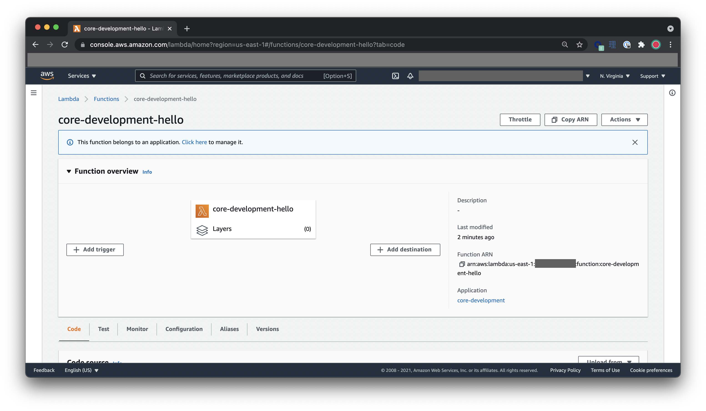

# CircleCI Serverless Example

## How I created this Serverless project?

```sh
# use the right Node runtime via NVM
nvm use

# install deps, including Serverless Framework
npm install

# create a folder for our FaaS project
mkdir -p src/services/core
cd src/services/core

# created a boilerplate project
npx serverless create --template aws-nodejs
```

## Successful Build

I was able to [deploy indeed to AWS with CircleCI and Serverless-Framework Orb specifically](https://app.circleci.com/pipelines/github/kelvintaywl/circleci-serverless-example/4/workflows/f5fa84d1-55f3-4584-8096-7a94dc07803e/jobs/5).
> I have added my AWS credentials via project environment variables.

Please see [my CircleCI config](.circleci/config.yml)


